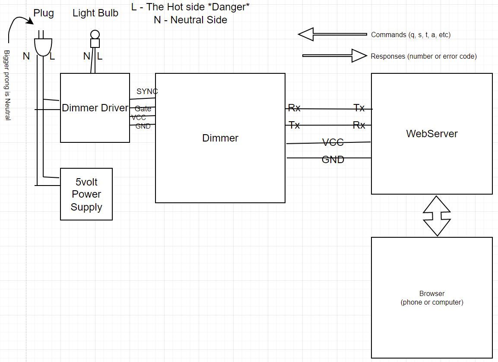

# Sunrise Clock

## Overview

The Sunrise Clock is a device that is similar to an alarm clock, that, using a circadian LED light bulb, 
gradually turns on the light bulb starting at the designated alarm time, until it is fully on.  Circadian lights simulate 
the natural outside sunlight and promotes better sleep by emiting specific wavelengths that simulate the sun rising in 
the morning.

An example of a circadian LED light can be found 
on Amazon at: [BIOS Lighting Circadian A19 LED Light Bulb](https://www.amazon.com/gp/product/B08VC71HSG/ref=ppx_yo_dt_b_search_asin_title?ie=UTF8&psc=1)  

## Parts is parts...

The Sunrise Clock has two parts to it, the Sunrise Clock Dimmer and the Sunrise Clock Webserver.

### The Sunrise Clock Dimmer (in the SunriseClockDimmer repository)  

This is a Spark Fun Pro Micro board (or equivilent), which manages the actual dimming. The Sunrise Clock Webserver
communicates to this board through a serial connection to send commands to it:

| Command | Description |
| ------- | ----------- |
| snnn | Set dim level manually |
| o | Turn light fully on |                             
| f | Turn light fully off |                            
| thh:mm:ss | Set current time |                                
| ahh:mm:ss | Set alarm time and turn alarm on | 
| a | Turn off alarm if it is on, or turn on if off |
| c | Cancel alarm if it has been triggered |   
| q | Query current time and alarm time |           
| w | Set wake up time in secs if default not desired. |
| d | Force alarm going off. |

For debugging purposes, you can type these commands into Arduino's USB serial monitor.

### The Sunrise Clock Webserver (this repository)
This is an ESP-01S board. This board has an ESP8266 chip on it and 4 meg of memory.

Arduino board setting for the ESP-01s board:
Board: "Generic ESP8266 Module"
Builtin LED: "2"
...
Flash Size: "$MB (FS:3MB OTA:~512KB)"
...

Some of the other settings can be set to various things depending on how you want to use it.  For example, you may want to set the 
Erase Flash setting to erase the WiFi Settings on upload.

### Sunrise Clock Diagram

